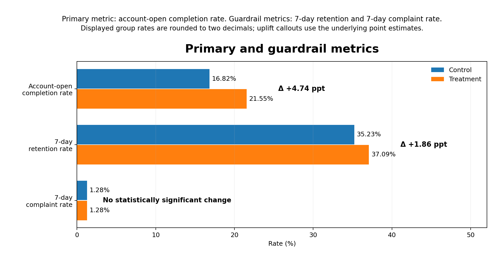
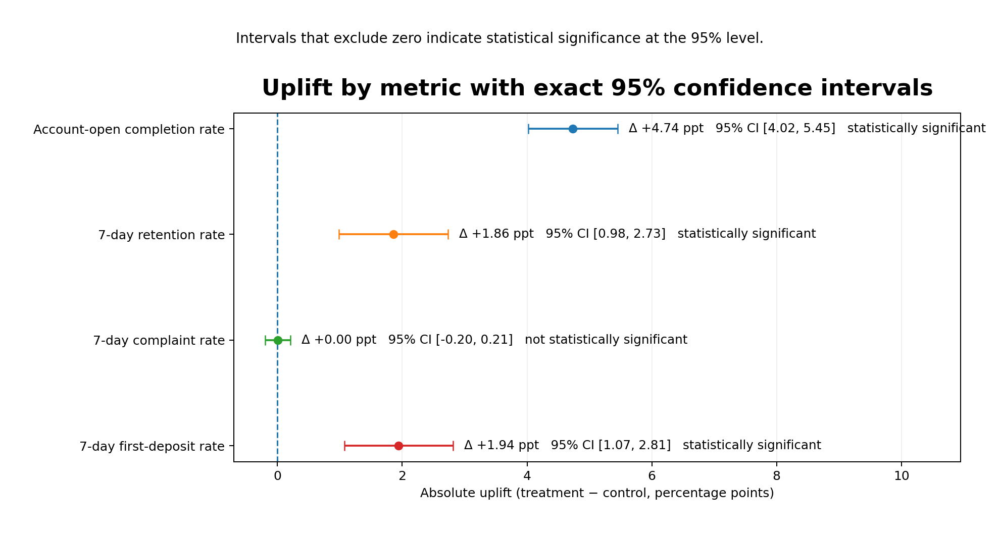

# Brokerage App Onboarding A/B Test

[](https://github.com/QILU-622/brokerage-onboarding-abtest/actions/workflows/tests.yml)

A portfolio case study showing how Python, SQL, funnel analysis, and statistical inference can support a staged rollout decision for a redesigned brokerage-app onboarding journey.

**Independent portfolio project** · Python · SQL · A/B testing · funnel diagnostics · confidence intervals · rollout governance

[Live project](https://qilu-622.github.io/brokerage-onboarding-abtest/) · [Technical report](TECHNICAL_REPORT.md) · [Python inference](analysis.py) · [SQL query library](sql/)

> **Data disclosure:** The dataset is entirely synthetic and was created solely for portfolio demonstration. It contains 46,218 simulated users and 221,046 simulated event records. It does not come from an internship, employer, client, brokerage, production system, or any confidential source.

## Decision question

After reducing form burden, improving process guidance, and clarifying key user questions, should the redesigned onboarding journey be expanded?

**Recommendation:** proceed to a channel-level staged rollout, but do not move directly to full release.

## Key synthetic experiment results

| Metric | Control | Treatment | Absolute change | 95% confidence interval |
|---|---:|---:|---:|---:|
| Account-opening completion | 16.82% | 21.55% | **+4.74 pp** | [4.02, 5.45] pp |
| 7-day retention | 35.23% | 37.09% | +1.86 pp | [0.98, 2.73] pp |
| 7-day first-deposit rate | 34.18% | 36.12% | +1.94 pp | [1.07, 2.81] pp |
| 7-day complaint rate | 1.277% | 1.280% | +0.00 pp | [-0.20, 0.21] pp |

The primary metric improved and the short-term quality metrics moved in the same direction, while the complaint-rate guardrail showed no statistically significant deterioration.

## Selected evidence





The full funnel and channel-level charts are available in [`figures/`](figures/), with their underlying result tables in [`results/`](results/).

These figures come from a **synthetic portfolio experiment** and are not live business impact. The bundled redesign also does not isolate the contribution of each individual change, and long-term customer value remains unvalidated.

## Analytical approach

- User-level 50/50 randomisation.
- Sample-balance and experiment-validity checks.
- Funnel diagnosis across onboarding stages.
- Two-sample proportion tests and 95% confidence intervals.
- Channel heterogeneity analysis with multiple-testing control.
- Primary metrics, commercial quality metrics, and complaint guardrails.
- Staged-rollout recommendation with monitoring and rollback conditions.

### Why Holm correction is used for channels, not all four overall metrics

The four overall metrics are not treated as one confirmatory hypothesis family. Account-opening completion is the single pre-specified primary outcome; retention and first deposit are supporting evidence; complaints are a harm guardrail. Applying one correction across efficacy and harm monitoring would reduce sensitivity to a damaging guardrail movement. By contrast, the five channel effects are same-status subgroup tests, so Holm correction controls their family-wise error rate. A future experiment with multiple co-primary success metrics would require a pre-specified hierarchy, gatekeeping rule, or multiplicity adjustment.

## What this project demonstrates

- **Experiment analysis:** connects randomisation, balance checks, confidence intervals, and multiple-testing control.
- **Product diagnosis:** separates total funnel uplift from the specific steps where friction changed.
- **Commercial judgement:** reads completion, retention, first deposit, and complaints together instead of optimising one conversion metric.
- **Rollout governance:** translates the evidence into channel priorities, monitoring requirements, and rollback conditions.

## Implementation and verification

| Evidence | What can be inspected |
|---|---|
| Count-based inference | Python recomputes rates, absolute uplift, unpooled 95% confidence intervals, pooled z-statistics, and two-sided p-values from success counts and sample sizes. |
| Source reconciliation | Every recomputed statistic is checked against the committed result table; inconsistent inputs fail before a decision summary is printed. |
| Regression tests | Seven tests cover the published primary result, four-metric completeness, metric roles, multiplicity policy, English output, inference fields, and invalid experiment counts. |
| Continuous integration | GitHub Actions runs the analysis and tests on Python 3.11 and 3.12 for every push and pull request. |

## Run locally

```bash
git clone https://github.com/QILU-622/brokerage-onboarding-abtest.git
cd brokerage-onboarding-abtest

python -m venv .venv
source .venv/bin/activate        # Windows: .venv\Scripts\activate

python -m pip install -r requirements.txt
python analysis.py
```

The script reads the example result tables in `results/` and prints the overall metric summary.

Optional regression checks:

```bash
python -m pip install -r requirements-dev.txt
pytest -q
```

## Repository guide

- [`index.html`](index.html): portfolio overview.
- [`analysis.py`](analysis.py): reproducible inference from committed counts, including confidence intervals, z-statistics, and p-values.
- [`TECHNICAL_REPORT.md`](TECHNICAL_REPORT.md): methods, assumptions, results, limitations, and rollout logic.
- [`sql/`](sql/): modular balance, metric, funnel, channel, and data-quality queries.
- [`figures/`](figures/): selected experiment, funnel, and heterogeneity charts.
- [`results/`](results/): committed result tables supporting the published findings.
- [`tests/test_summary.py`](tests/test_summary.py): regression checks for the published experiment summary.
- [`.github/workflows/tests.yml`](.github/workflows/tests.yml): automated verification on Python 3.11 and 3.12.
- [`requirements.txt`](requirements.txt): Python dependencies.
- [`requirements-dev.txt`](requirements-dev.txt): optional test dependency.

## Decision boundary

The current evidence supports further staged testing, not immediate full rollout. Before expansion, the experiment should continue to verify allocation validity, process guardrails, contamination risk, cross-device identity handling, and longer-term value.
